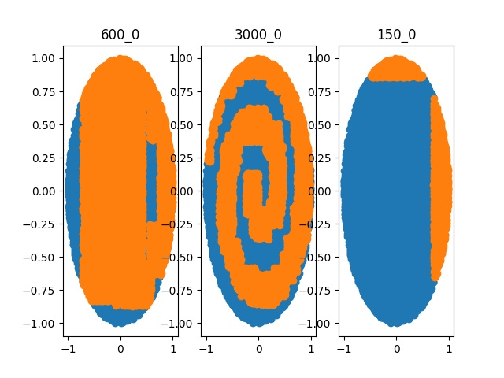
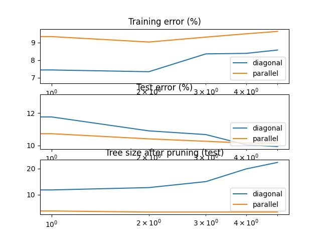
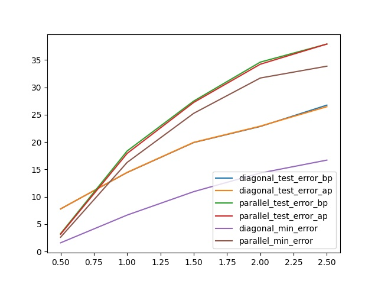
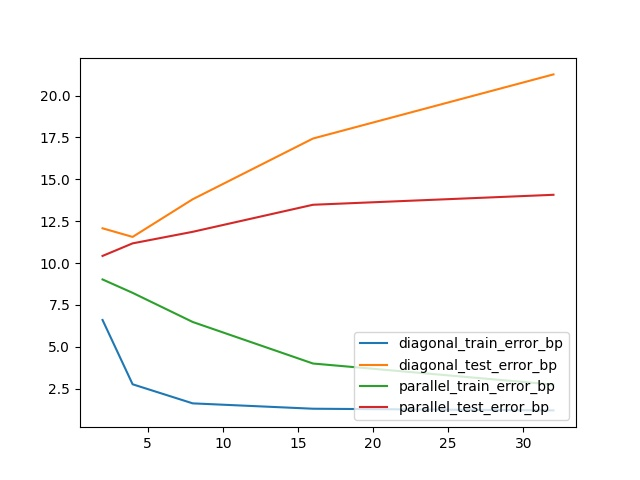

# Trabajo práctico 1 - Introducción al Aprendizaje Automatizado.

### Stizza, Federico.

# Ejercicio 4

Resultado de las predicciones del arbol entrenado con 150, 600 y 3.000 ejemplos. Sobre el conjunto de test de 10.000 elementos.

Se puede observar en el gráfico que los arboles generados por los conjuntos de entrenamiento *pequeños* (150 y 600 ejemplos) no definen un conjunto de reglas precisas para clasificar el dataset espirales anidados. 

El error de clasificación en estos árboles es muy grande **~40%** y **~30%** respectivamente. 

Estos errores se deben a que los conjuntos de entrenamientos son muy pequeños en base a la complejidad del dataset lo que que concluye en reglas muy generales que no capturan el comportamiento deseado. 

# Ejercicio 5

Error de entrenamiento, de test y tamaño final del árbol en función del tamaño del conjunto de entrenamiento.

Podemos observar que el error de entrenamiento tiende a incrementarse y el de test a decrementarse.

Esto es algo relativamente esperable, ya que a mayor cantidad de ejemplos de entrenamiento las reglas empiezan a ser más precisas.

A diferencia del ejercicio anterior, estos *datasets* no requieren que las reglas sean tan específicas, por eso la diferencia entre los errores de entrenamiento y de prueba no es tan grande.

Por ejemplo, el dataset *paralelo* se podría clasificar en función de la coordenada x del punto. Y el *diagonal* se podrían clasificar dependiendo del lado que se encuentre el punto respecto a la coordenada (x,x). Claramente las reglas resultantes deberían ser más sencillas y por eso requerir una menor cantidad de ejemplos de entrenamiento para concluir en un árbol suficientemente *correcto*.

## Ejercicio 6

Error de test de los problemas *paralelo* y *diagonal* antes de podar y después de hacerlo en función del overlapping de las clases (parámetro C).

Al aumentar el valor de *C* se incrementa la superposición de las clases, por lo que si mantenemos fijo el tamaño del conjunto de entrenamiento, las reglas generadas no son lo suficientemente precisas para clasificar los datos de los problemas.

Además podemos observar que el prunning no está eliminando nodos porque no pudo generalizar las reglas.

# Ejercicio 7

Error de entrenamiento y de test en función de la cantidad de dimensiones del problema.

A mayor de cantidad de dimensiones, el error de entrenamiento disminuye en ambos problemas y aumenta el de test.

Una posible explicación a este comportamiento puede ser que los árboles generados deben clasificar los ejemplos dependiendo de los valores de alguna de las xi componentes por lo que en el conjunto de test que seguro se encuentran comportamientos más variados no puede clasificar correctamente.