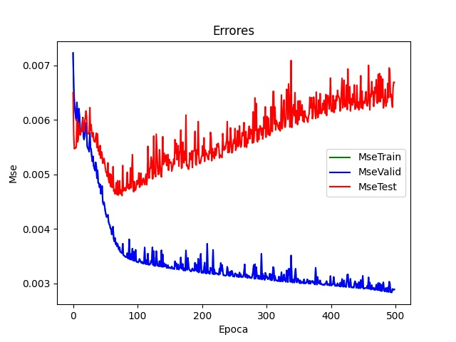
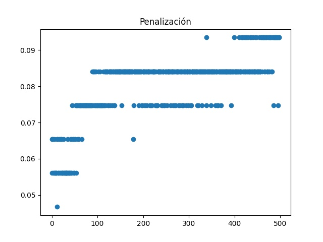

# Trabajo práctico 1 - Introducción al Aprendizaje Automatizado.

### Stizza, Federico.

# Ejercicio A

Para entrenar la red neuronal múltiples combinaciones de *learning-rate* y *momentum* (más de 30)
y los 3 mejores resultados de error promedio fueron las siguientes:

| Learning rate      | Momentum | Error promedio |
| ------------------ | -------- | -------------- |
| 0.1        **(i)** | 0.0      | 0.090989       |
| **0.1** **(ii)**       | 0.5      | 0.093909       |
| 0.01     **(iii)** | 0.9      | 0.097081       |

## (i)

## (ii)

x
## (iii)

Se puede observar que sin momentum las redes se quedan en ciertos minimos locales que no son los óptimos, pero también al agregarle mucho momentum tenemos que es contraproducente porque genera que pierda el minimo que era bueno y pasen a errores mayores como ocurre en el último gráfico. 

# Ejercicio B

## 95% - 5%

## 75% - 25%

## 50% - 50%

Para las redes entrenadas muchos ejemplos se puede observar el sobre ajuste que se genera y lo erroneo que es comparado con el error de validación. Luego al usar más ejemplos de test se nota que el ajuste es menor y baja el error de validación, entonces está mejor entrenada. Por último al tener pocos ejemplos de entrenamiento el error se vuelve a disparar, por lo que hay que elegir una proporción ligeramente mayor de entrenamiento que de test para que la red sea más eficiente.

# Ejercicio C

### Gamma = 1e-8

### Gamma = 1e-6

### Gamma = 1e-4

### Gamma = 1e-2

### Gamma = 1

Podemos observar que a medida que el *gamma* se agranda, el sobreajuste también. Esto se debe a que a mayor penalización menos se modifica más lentamente los pesos de las conexiones y evita que la red sobreaprenda los ejemplos.

# Ejercicio D

Se puede observar que los resultados se mantienen casi iguales menos en el caso del problema *diagonal* donde se destaca que la red neuronal tiene menos error que su versión del árbol de decisión.

