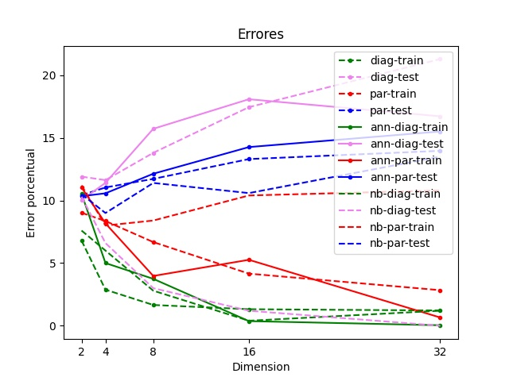
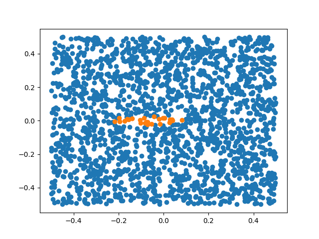
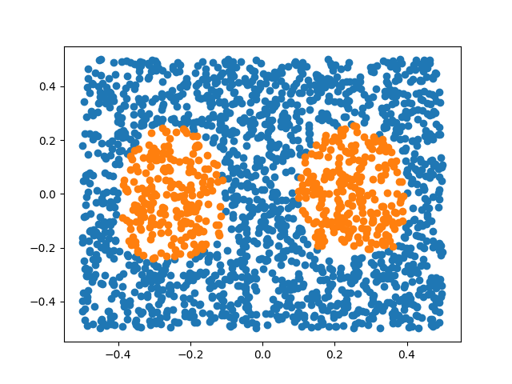
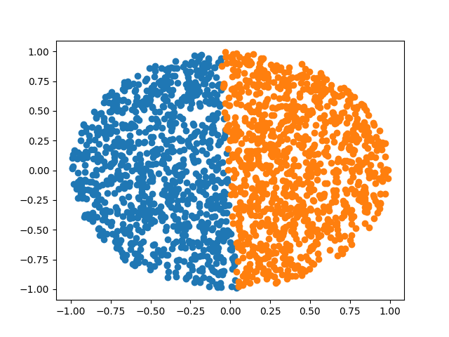
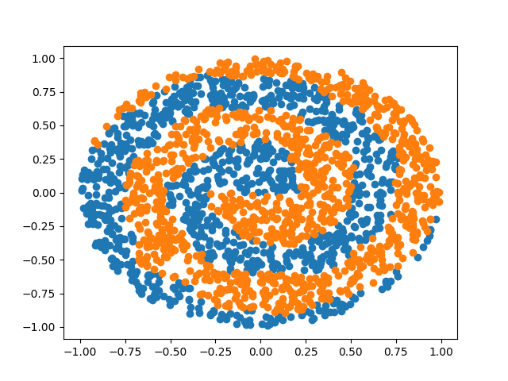
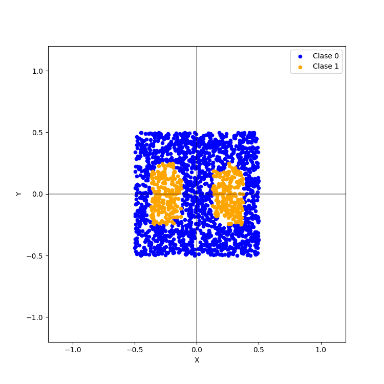
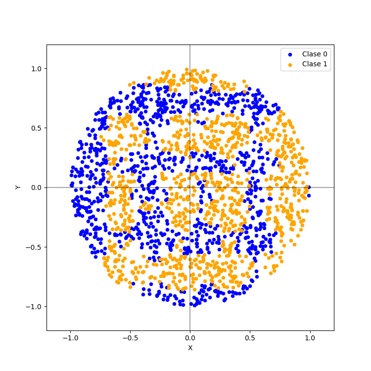
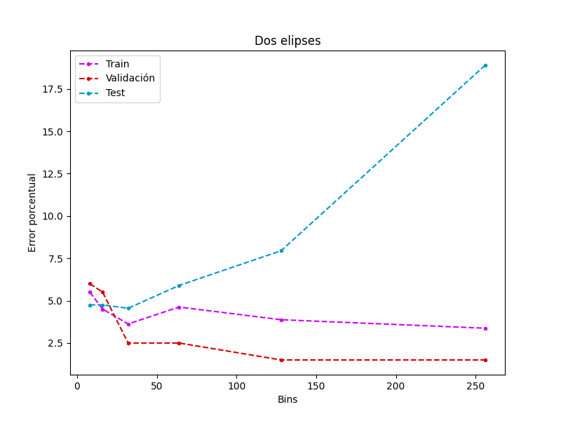
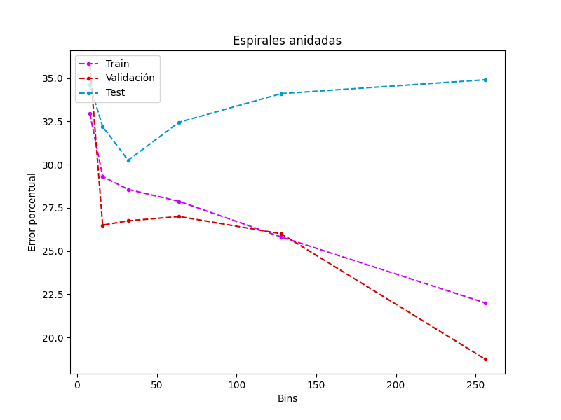

# Trabajo práctico 3 - Introducción al Aprendizaje Automatizado.

### Stizza, Federico.

# Ejercicio 1

La implementación del clasificador *Naive-Bayes* con probabilidad aproximada por *gaussianas* está en el archivo: **nb_n.c**.

# Ejercicio 2

Ejercicio de *dimensionalidad* calculado con el clasificador de *Bayes*. Los resultados se presentan junto a los resultados de los prácticos anteriores.

Se puede observar que el error porcentual de training de ambos problemas decrece a medida que se aumenta la cantidad de dimensiones. Esto se debe a que ambos problemas tienen la particularidad de que las *features* se calculan de manera independiente, variando el centro de la misma y esto es exactamente lo que el clasificador de *Bayes* asume para trabajar.

Además el error de test es un poco menor que los otros clasificadores. Y no se percibe sobre ajuste en los datos.

# Ejercicio 3

### Dos elipses Naive-Bayes

### Dos elipses Redes Neuronales

### Espirales anidadas Naive-Bayes

### Espirales anidadas Redes Neuronales

Se puede observar que los dos resultados de *Naive-Bayes* son muy malos. El problema se encuentra en la forma de calcular la probabilidad de que el punto pertenezca a una clase. Nuestro clasificador está utilizando la probabilidad de una distribución normal (gaussiana) y los puntos de ambos datasets están generados con probabilidades uniformes.

En este caso las redes neuronales tienen una mejor aproximación de los resultados finales.

# Ejercicio 4

La implementación del clasificador *Naive-Bayes* con probabilidad aproximada por *histogramas* está en el archivo: **nb_n.c**.

Se realizó el experimento con diferentes cantidades de *bins* de los histogramas y los mejores resultados son:

* 16 para el problema de **dos elipses**.
* 32 para el problema de **espirales anidadas**.

Se puede ver que el mejor resultado es el de los dos elipses. Esto se debe a que los histogramas permiten clasificar los datos asimétricamente, sin un centro como era el modelo anterior.

En el caso de las espirales anidadas si bien mejora notablemente en comparación al clasificador de las normales, se puede notar que no obtiene resultados muy acertados, esto se debe a que cada eje es una variable independiente para el clasificador y por la complejidad de los datos las probabilidades de caer dentro de alguna de las curvas en los extremos no difiere mucho y posee mucho más error.

Por último, las gráficas de los errores de entrenamiento, test y validación nos permiten observar que a mayor cantidad de *Bins*, se produce un mayor sobre ajuste. Esto se debe a que el tamaño de los bins es uniforme (1/NBINS) y por lo tanto la probabilidad de caer en cada uno de estos es menor.