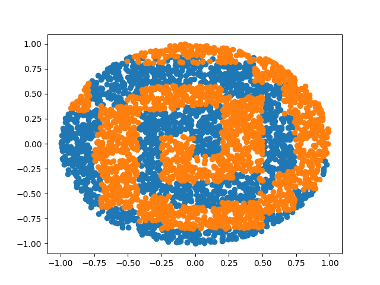

# Trabajo práctico 4 - Introducción al Aprendizaje Automatizado.

### Stizza, Federico.

# Ejercicio 1

La implementación del clasificador de *K vecinos* se encuentra en el archivo: **knn.c**.

# Ejercicio 2

## Espirales anidadas 

Se puede observar que el clasificador de *K-Vecinos* tiene un resultado mucho mejor que el de los árboles de decisión. Esto se debe a que el problema presenta un gran densidad de puntos entre las curvas de las espirales. Sobre los bordes podemos ver que hay algunos errores de clasificación que ocurren porque las densidades se equiparan en esas zonas. 

## Espirales anidadas (con ruido) 

Por otro lado vemos que el resultado de *K-Vecinos* para las espirales con ruido es muy malo. Esto ocurre porque nuestro algoritmo le da la misma importancia a todas las variables de entrada entonces la votación de la clase se disputa entre variables que no tienen relevancia en el resultado final.

# Ejercicio 3

Para el ejercicio de dimensionalidad se realizó un barrido en el rango [2, 40] con el objetivo de obtener el número de vecinos que minimiza el error de validación.

| Dimensión (problema) | Número de vecinos |
| -------------------- | ----------------- |
| 2  (diagonal)        | 3                 |
| 4  (diagonal)        | 30                |
| 8  (diagonal)        | 7                 |
| 16 (diagonal)        | 30                |
| 32 (diagonal)        | 5                 |
| 2  (paralelo)        | 4                 |
| 4  (paralelo)        | 3                 |
| 8  (paralelo)        | 27                |
| 16 (paralelo)        | 2                 |
| 32 (paralelo)        | 3                 |

Podemos observar que el error de entrenamiento para ambos casos (el de diagonal no se ve pero esta ahí) cuando es *K=1* es 0, lo cual ocurre porque el punto que define la clase se encuentra en el conjunto de entramiento y por lo tanto la distancia siempre es 0 y siempre es el que gana la votación. 

Por otro lado, el error de test del problema *diagonal* aumenta a medida que crece el número de dimensiones mientras que el del paralelo decrece. Esto ocurre porque a medida que se tienen más dimensiones hay menos vecinos que definen cada clase y resulta en errores de votación.

El error de test del problema *diagonal* es bastante irregular lo cual puede ocurrir porque a medida que aumentan las dimensiones hay mas clases que compiten y por lo que confunde más a nuestro algoritmo.

Por el contrario el error del *paralelo* mejora a medida que crecen las dimensiones ya que la distancia euclideana funciona bien para este problema ya que a mas dimensiones los ejemplos estan más distantes.

